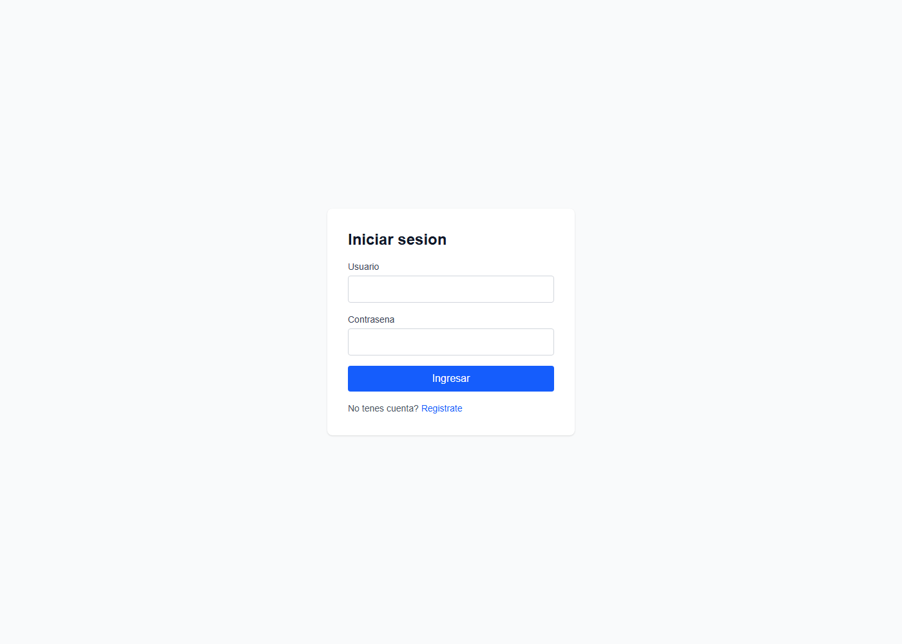
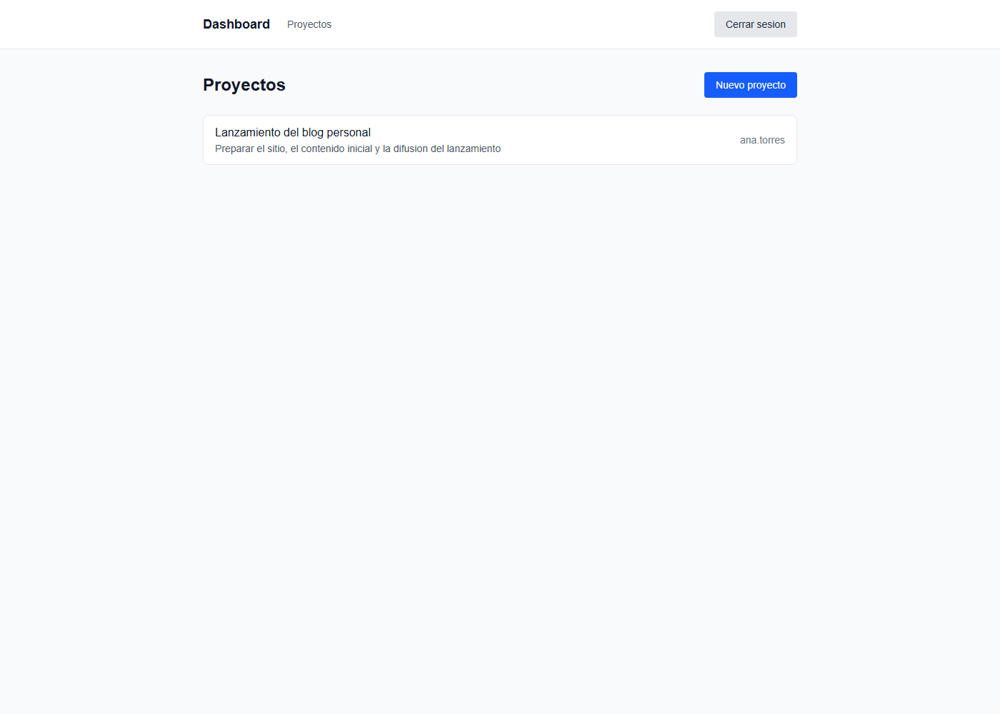
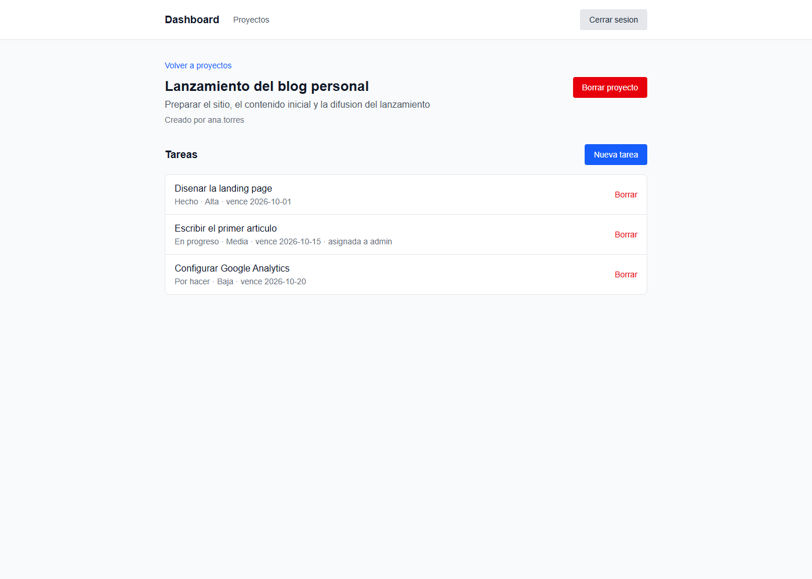
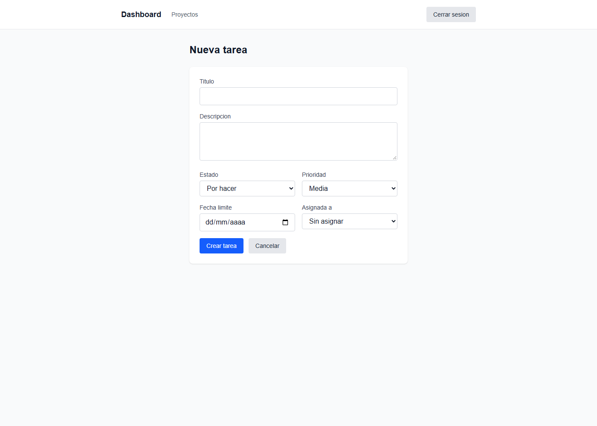
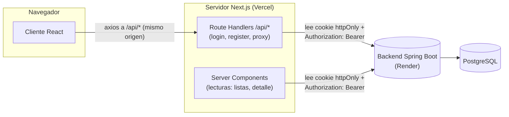

# Dashboard de Gestión

Aplicación full-stack de gestión de proyectos y tareas, con autenticación JWT y
permisos por rol. Backend en **Java + Spring Boot**, frontend en **Next.js**,
desacoplados y deployados por separado.

**[Ver demo en vivo](https://dashboard-gestion-u8at.vercel.app)**

> El backend corre en el free tier de Render, que duerme tras 15 minutos sin
> tráfico. Un ping automático lo mantiene despierto la mayor parte del tiempo,
> pero si es la primera visita en un rato puede tardar unos segundos en
> responder — la propia app lo avisa en pantalla mientras espera.



## Qué hace

Cada usuario gestiona sus propios proyectos y las tareas dentro de ellos:

- Registro y login con JWT.
- Crear, ver, editar y borrar **proyectos**.
- Crear, ver, editar y borrar **tareas** dentro de un proyecto (estado,
  prioridad, fecha límite, asignación a un usuario).
- Un usuario común solo ve sus propios proyectos; un **ADMIN** ve y administra
  los de todos.
- Intentar acceder a un proyecto ajeno devuelve un mensaje claro de "no tenés
  permisos", nunca una pantalla rota ni datos de otro usuario.





## Stack

| | |
|---|---|
| **Backend** | Java 21 · Spring Boot 3.3.4 · Spring Security + JWT (jjwt) · Spring Data JPA · PostgreSQL |
| **Frontend** | Next.js 16 (App Router) · React 19 · Tailwind CSS · Axios |
| **Deploy** | Backend en Render (Docker) · Frontend en Vercel · GitHub Actions (keep-alive) |

## Arquitectura

El JWT se guarda en una **cookie httpOnly** (nunca en `localStorage`), así un
script malicioso no puede robarlo. Como consecuencia, el navegador nunca le
habla directo al backend: todo pasa por rutas propias del servidor de Next.js,
que son las únicas que pueden leer esa cookie y armar el header
`Authorization`.



Por esto tampoco hace falta configurar CORS: CORS existe para cuando el
*navegador* le habla a un dominio distinto, y acá el navegador solo le habla a
Vercel — es el servidor el que le habla a Render.

## Decisiones técnicas que vale la pena mencionar

- **Roles como entidad separada** (`User` ↔ `Role`, `@ManyToMany`), no un
  string plano — permite agregar roles sin tocar el esquema.
- **DTOs separados de las entities**: nunca se expone una entity de JPA
  directo en una respuesta de la API.
- **Autorización en la capa de servicio**, no en el controller: cada
  operación sobre un proyecto o tarea verifica si quien la pide es el dueño o
  un ADMIN antes de ejecutarla.
- **El registro nunca deja elegir el rol** del lado del cliente — siempre
  asigna `ROLE_USER`, para que nadie pueda autoasignarse ADMIN.
- **Errores consistentes en JSON** (`GlobalExceptionHandler`): validación,
  404, 403 y 500 siempre con la misma forma de respuesta, nunca una página de
  error HTML.

## Estructura del repo

```
dashboard-project/
├── dashboard-backend/   → API REST (Spring Boot)
├── dashboard-frontend/  → Next.js App Router
└── .github/workflows/   → keep-alive del backend en Render
```

Cada subproyecto tiene su propio README con instrucciones para correrlo en
local: [`dashboard-backend/README.md`](dashboard-backend/README.md) ·
[`dashboard-frontend/README.md`](dashboard-frontend/README.md).

## Qué mejoraría con más tiempo

- Migraciones versionadas (Flyway/Liquibase) en vez de
  `spring.jpa.hibernate.ddl-auto=update`.
- Tests automatizados (unitarios de servicios, de integración de la API).
- Backend en un plan pago para eliminar el cold start de raíz en vez de
  mitigarlo con un keep-alive.
